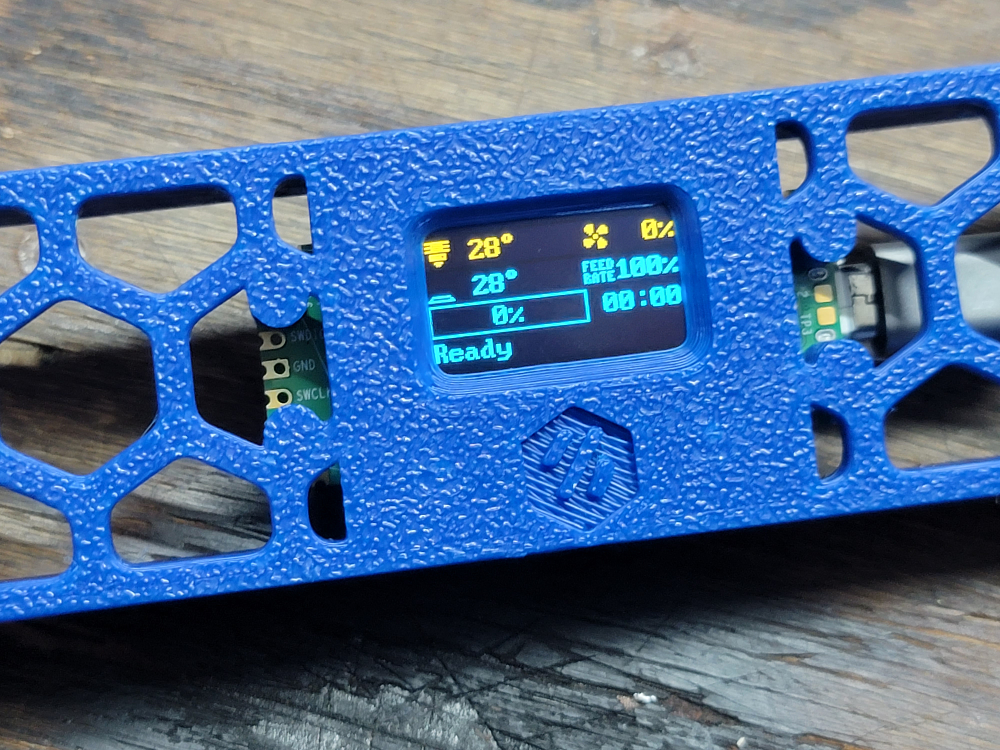
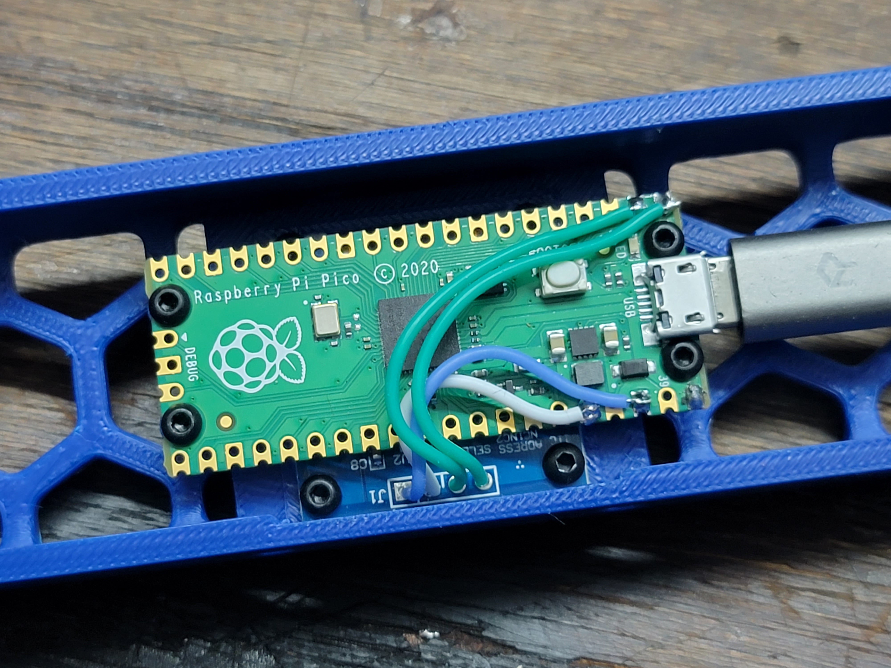
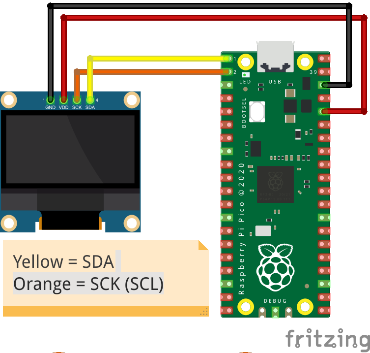
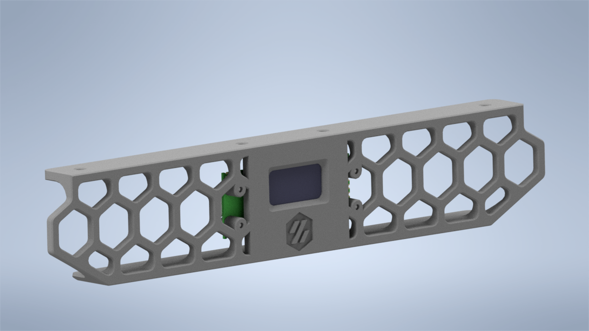
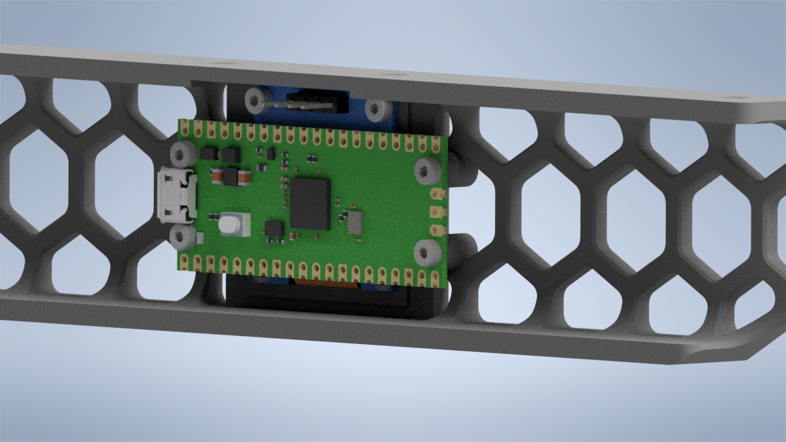
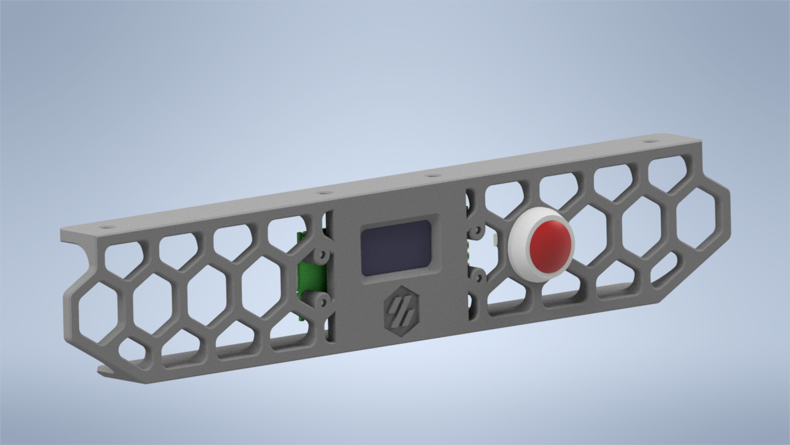
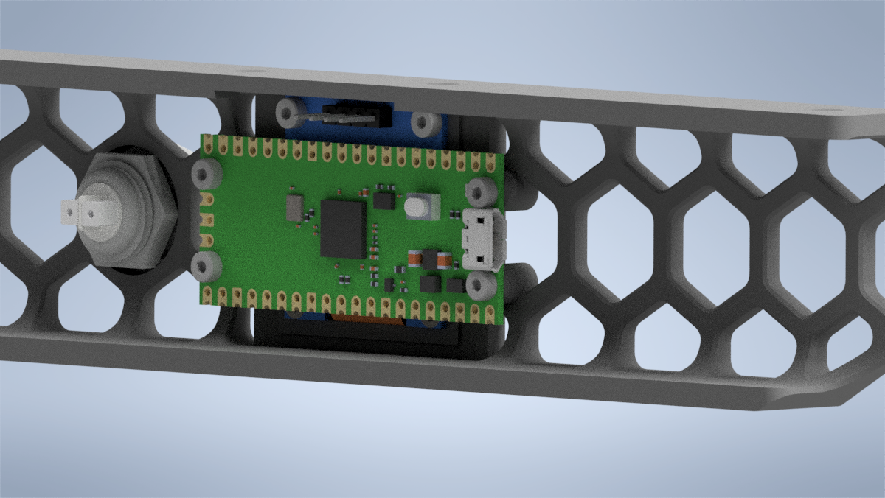

## Purpose

The purpose of this mod is to provide an additional MCU to the V0.1 to drive a small OLED display in the skirt.  Originally, the reason I started on the design was because I was running into I2C timeout errors on my SSD1306 display when running it directly off of the SKR mainboard in my V0.1, due to the extremely long wire runs which I2C was not designed for.  After all - I2C stands for Inter-Integrated Circuit, and was designed to connect two ICs locally on a single PCB.  As such, it does not do well with long wire runs such as the one I was using to drive the display originally.  

 

It utilizes a Raspberry Pi Pico MCU, which became supported in Klipper not too long ago.  At only $4 a piece, it offers an extremely affordable way to add an MCU to your V0.1.  The display itself is a SSD1306 0.96" I2C-Controlled OLED from UCTRONICS on Amazon, though I'd wager just about any 0.96" I2C OLED panel you buy will work as they all seem to have the same layout and dimensions.  The Pico then connects to the Raspberry Pi running Klipper over USB, and that's it!

Becuase this is an entirely separate MCU, you can do a lot more with it than just driving a small display.  You could easily add some wiring to connect to an ADXL345 to run input shaper, drive some NeoPixels, control an external MOSFET, and more.  

 

## Wiring the display to the Pico MCU

Seeing as the display uses I2C wiring is super simple, using only four wires of which two are used for power.  
** IMPORTANT ** the Pico GPIO is only rated to 3.3V.  As such you must run the SSD1306 display off of 3.3V, NOT 5V.  
Wire them together according to this diagram.  I prefer to desolder the pins from the OLED display and solder directly to the pads to keep it as low profile as possible.  

 
Photo Credit Tom's Hardware.

## Making the Pico Firmware

To flash the Pico MCU, SSH into your Pi and enter these commands.

1. cd ~/klipper
2. make clean
3. make menuconfig  
    Micro-controller Architecture should be set to "Raspberry Pi RP2040"  
    Communication Interface should be USB  
4. Q (asks you to save, hit Y)
5. make

## Flashing your Pico

There's a couple ways to flash the firmware to the Pico.  You can either do it on the Pi itself (faster), or use FTP to grab the firmware from the Pi and use a Windows PC to copy it to the Pico (easier).  These instructions are the easier way:

1. once the make command completes, use FileZilla or a similar FTP program to log into the Pi and download klipper.uf2 from ~/klipper/out
2. Put your Pico into bootloader mode.  To do this, plug the Pico into your PC while holding the BOOTSEL button.  It will pop up on This PC as a mass storage device with a capacity of 128MB.
3. Copy the klipper.uf2 to the Pico.  Once copied, it will automatically unmount from the PC, reboot, flash, and that's it. 

## Setting up .cfg 

Once done with flashing the Pico, all you have to do is upload the pico.cfg I've included to the config folder on your main Pi, then add [include pico.cfg] to your main printer.cfg.  Alternatively, you can just copy the contents of pico.cfg to your main printer.cfg.  I prefer the separate cfg myself, though.

Plug the Pico into your Pi via USB, run the cable as needed, then do the same commands you normally do to find the serial ID of the new MCU:

1. ls -l /dev/serial/by-id
2. it will be something like /usb-Klipper_rp2040.  
3. copy that serial ID (the entire thing, not just the /usb-Klipper_rp2040 part) and replace what's currently in pico.cfg.

Once that's done, you should be able to do a firmware restart and see your new OLED display working just as intended.

## STL Options
There are two STLs available.  One of them is just the display and Pico, and the other has accommodations for a 16mm pushbutton to function as an emergency stop button.  This can be wired directly to the Pico MCU.  I do not have a config example and wiring diagram for this, but it should be quite easy.  Just do a bit of research.

 
 
 
 

STEP files have also been included in /CAD to allow you to add whatever you want to the skirt.  
