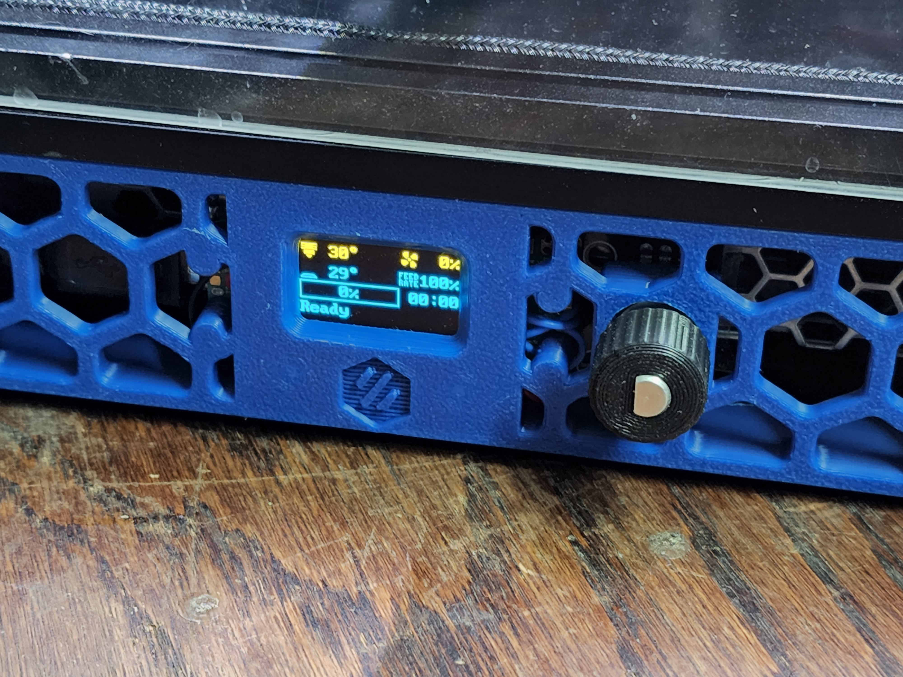
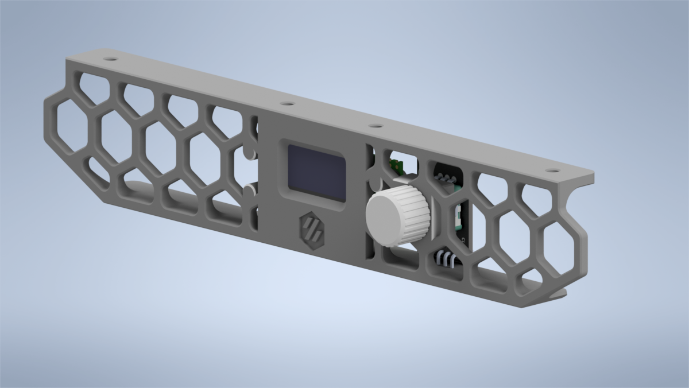

## Purpose

The purpose of this mod is to provide an additional MCU to the V0.1 to drive a small OLED display in the skirt, as well as provide a rotary encoder interface for the menus.  Originally, the reason I started on the design was because I was running into I2C timeout errors on my SSD1306 display when running it directly off of the SKR mainboard in my V0.1, due to the extremely long wire runs which I2C was not designed for.  After all - I2C stands for Inter-Integrated Circuit, and was designed to connect two ICs locally on a single PCB.  As such, it does not do well with long wire runs such as the one I was using to drive the display originally.  

 

It utilizes a Raspberry Pi Pico MCU, which became supported in Klipper not too long ago.  At only $4 a piece, it offers an extremely affordable way to add an MCU to your V0.1.  The display itself is a SSD1306 0.96" I2C-Controlled OLED from UCTRONICS on Amazon, though I'd wager just about any 0.96" I2C OLED panel you buy will work as they all seem to have the same layout and dimensions.  The encoder is a typical KY-040 encoder, available for very cheap all over the place. The Pico then connects to the Raspberry Pi running Klipper over USB, and that's it!

Becuase this is an entirely separate MCU, you can do a lot more with it than just driving a small display and the encoder.  You could easily add some wiring to connect to an ADXL345 to run input shaper (custom wiring harness and connector required), drive some NeoPixels, control an external MOSFET for e.g. fan control, and more.  

 

## Wiring the display to the Pico MCU

Seeing as the display uses I2C wiring is super simple, using only four wires of which two are used for power.  
** IMPORTANT ** the Pico GPIO is only rated to 3.3V.  I'm not sure if the SSD1306 modules have internal level shifters to ensure the I2C level is kept at 3.3V when powered by 5V, so I'd power the display from 3.3V rather than 5V just to be safe.
Wire them together according to the below list.  I prefer to desolder the pins from the OLED display and solder directly to the pads to keep it as low profile as possible.  

VCC --> 3V3  
GND --> GND  
SCK --> GP1  
SDA --> GP0  

## Wiring the encoder to the Pico MCU

The encoder wiring is also quite simple.  Follow the below list.  You will need to either cut off/desolder the pins or bend them out of the way, because how they come out of the package the pins will hit the skirt piece.

VCC --> 3V3  
GND --> GND  
SW --> GP18  
DT --> GP17  
CLK --> GP16  

## Making the Pico Firmware

To flash the Pico MCU, SSH into your Pi and enter these commands.

1. cd ~/klipper
2. make clean
3. make menuconfig  
    Micro-controller Architecture should be set to "Raspberry Pi RP2040"  
    Communication Interface should be USB  
4. Q (asks you to save, hit Y)
5. make

## Flashing your Pico

Once the make commmand is finished, there's a couple ways to flash the firmware to the Pico.  You can either do it on the Pi itself (faster), or use FTP to grab the firmware from the Pi and use a Windows PC to copy it to the Pico (easier).  These instructions are the easier way:

1. Use FileZilla or a similar FTP program to log into the Pi and download klipper.uf2 from ~/klipper/out
2. Put your Pico into bootloader mode.  To do this, plug the Pico into your PC while holding the BOOTSEL button.  It will pop up on This PC as a mass storage device with a capacity of 128MB.
3. Copy the klipper.uf2 to the Pico.  Once copied, it will automatically unmount from the PC, reboot, flash, and that's it. 

## Setting up .cfg 

Once done with flashing the Pico, all you have to do is upload the pico.cfg I've included to the config folder on your main Pi, then add [include pico.cfg] to your main printer.cfg.  Alternatively, you can just copy the contents of pico.cfg to your main printer.cfg.  I prefer the separate cfg myself, though.

Plug the Pico into your Pi via USB, run the cable as needed, then do the same commands you normally do to find the serial ID of the new MCU:

1. ls -l /dev/serial/by-id  
    it will be something like /usb-Klipper_rp2040.  
2. copy that serial ID and replace what's currently in pico.cfg.

Once that's done, you should be able to do a firmware restart and see your new OLED display working just as intended.  You can also test your encoder to ensure it is working.  Note that for some reason the click part of the encoder seems to lag a bit, I'm not really sure why.  The scrolling, however, is very responsive.

STEP files have also been included in /CAD to allow you to add whatever you want to the skirt.  

## Notes
1. An 18" micro USB seems to be the perfect length. Obviously longer will work, but you'll need to wrap it around itself a few times to shorten it.  The [MonoPrice 1.5ft Micro USB](https://smile.amazon.com/gp/product/B002HZYBZ6) cable on Amazon is exactly what I am using, and it works great.
2. If you plan to drive NeoPixels with this, beware that it's powered only by the 5V USB line, so you'll be limited in the number of NeoPixels you can drive off the Pico directly.
3. You only need to use the two outermost holes in the skirt to screw the Skirt down.  It has four since it was made using the two separate skirt pieces, but in reality one on each end is fine.  It'd be pretty hard to access the ones towards the middle anyway, what with the Pi and stuff in the way.
4. The hole in the skirt for the encoder is closed off for printability.  It's only one or two layers thick, so that you're not trying to bridge in a circle.  This allows printing without supports.  Once printed, simply use an X-Acto knife or similar to cut out the thin layers.
5. In order to use the Knob_Shortened.stl provided in STLs/CAD, you need to shorten the encoder spline by 5mm.  I found the knob it comes with to be disproportionately long.  Alternatively, I've included the STLs and CAD for the same knob but with a hole in the end (Knob_Through.stl) to allow the spline to extend past.  It looks a bit silly, but it works if you don't have the equipment to shorten the spline on the encoder.
6. You may have to trim a little bit of the PCB on the encoder at the bottom to prevent it from rubbing on/hitting the skirt.  
7. For some reason, when you first start up the printer, or restart Klipper, the display acts like you clicked the encoder button, and enters the menu.  I am not sure why this is.  If you have any suggestions, or manage to figure out why and/or fix it, I'd love to hear from you.
8. The encoder sticks out quite a bit in the back, inside the skirt.  You may need to move your PSU just slightly inward to avoid the encoder body interfering with the PSU.
9. One weird thing about these SSD1306 OLED displays is that they often have a different color for the top row.  I'm not really sure why this is, but naturally that means the top row of the mdnu will always be that color (in my case, yellow).  I believe there are some of these that are all one color, but that's not what I have.

## USB Cable Routing
This is the best routing I've found for the USB cable. 

 
 

=======
## Purpose

The purpose of this mod is to provide an additional MCU to the V0.1 to drive a small OLED display in the skirt, as well as provide a rotary encoder interface for the menus.  Originally, the reason I started on the design was because I was running into I2C timeout errors on my SSD1306 display when running it directly off of the SKR mainboard in my V0.1, due to the extremely long wire runs which I2C was not designed for.  After all - I2C stands for Inter-Integrated Circuit, and was designed to connect two ICs locally on a single PCB.  As such, it does not do well with long wire runs such as the one I was using to drive the display originally.  

 

It utilizes a Raspberry Pi Pico MCU, which became supported in Klipper not too long ago.  At only $4 a piece, it offers an extremely affordable way to add an MCU to your V0.1.  The display itself is a SSD1306 0.96" I2C-Controlled OLED from UCTRONICS on Amazon, though I'd wager just about any 0.96" I2C OLED panel you buy will work as they all seem to have the same layout and dimensions.  The encoder is a typical KY-040 encoder, available for very cheap all over the place. The Pico then connects to the Raspberry Pi running Klipper over USB, and that's it!

Becuase this is an entirely separate MCU, you can do a lot more with it than just driving a small display and the encoder.  You could easily add some wiring to connect to an ADXL345 to run input shaper (custom wiring harness and connector required), drive some NeoPixels, control an external MOSFET for e.g. fan control, and more.  

 

## Wiring the display to the Pico MCU

Seeing as the display uses I2C wiring is super simple, using only four wires of which two are used for power.  
** IMPORTANT ** the Pico GPIO is only rated to 3.3V.  I'm not sure if the SSD1306 modules have internal level shifters to ensure the I2C level is kept at 3.3V when powered by 5V, so I'd power the display from 3.3V rather than 5V just to be safe.
Wire them together according to the below list.  I prefer to desolder the pins from the OLED display and solder directly to the pads to keep it as low profile as possible.  

VCC --> 3V3  
GND --> GND  
SCK --> GP1  
SDA --> GP0  

## Wiring the encoder to the Pico MCU

The encoder wiring is also quite simple.  Follow the below list.  You will need to either cut off/desolder the pins or bend them out of the way, because how they come out of the package the pins will hit the skirt piece.

VCC --> 3V3  
GND --> GND  
SW --> GP18  
DT --> GP17  
CLK --> GP16  

## Making the Pico Firmware

To build the firmware for the Pico MCU, SSH into your Pi and enter these commands.

1. cd ~/klipper
2. make clean
3. make menuconfig  
    Micro-controller Architecture should be set to "Raspberry Pi RP2040"  
    Communication Interface should be USB  
4. Q (asks you to save, hit Y)

## Flashing your Pico

Once the make commmand is finished, there's a couple ways to flash the firmware to the Pico.  You can either do it on the Pi itself (faster and easier), or use FTP to grab the firmware from the Pi and use a Windows PC to copy it to the Pico (alternate if the first method doesn't work).  These instructions are the faster and easier way.

1. Unplug your Pico USB from the Pi if it is plugged in.
2. Enter bootloader mode by holding the BOOTSEL button on the Pico while plugging the USB into the Pi.
3. Back into SSH under ~/klipper, enter this command: 
    make flash FLASH_DEVICE=2e8a:0003  
    This will make your firmware, then flash it to the Pico via USB.  This method wasn't available when I originally created this mod, so it's nice to see this is         possible now.
5. Check if the Pico was successfully flashed by typing the following command into your SSH shell.  You may need to first unplug the Pico and plug it back in, and/or       restart the entire printer. 
    ls /dev/serial/by-id/usb-Klipper_rp2040*   
    If it's been successfully flashed, it will show up as something like this:  
        usb-Klipper_rp2040_E660C06213844C34-if00 

Nothing will show up on the OLED yet, since nothing is configured in Klipper yet.  We'll do that now.

## Setting up .cfg 

Once done with flashing the Pico, all you have to do is upload the pico.cfg I've included to the config folder on your main Pi, then add [include pico.cfg] to your main printer.cfg.  Alternatively, you can just copy the contents of pico.cfg to your main printer.cfg.  I prefer the separate cfg myself, though.

Plug the Pico into your Pi via USB, run the cable as needed, then do the same commands you normally do to find the serial ID of the new MCU:

1. ls /dev/serial/by-id/usb-Klipper_rp2040*  
    It will show up as something like this:  
        usb-Klipper_rp2040_E660C06213844C34-if00 
2. Copy that serial ID and replace what's currently in pico.cfg.

Once that's done, you should be able to do a firmware restart and see your new OLED display working just as intended.  You can also test your encoder to ensure it is working.  It should be fast and responsive.

STEP files have also been included in /CAD to allow you to add whatever you want to the skirt.  

## Notes
1. An 18" micro USB seems to be the perfect length. Obviously longer will work, but you'll need to wrap it around itself a few times to shorten it.  The [MonoPrice 1.5ft Micro USB](https://smile.amazon.com/gp/product/B002HZYBZ6) cable on Amazon is exactly what I am using, and it works great.
2. If you plan to drive NeoPixels with this, beware that it's powered only by the 5V USB line, so you'll be limited in the number of NeoPixels you can drive off the Pico directly.
3. You only need to use the two outermost holes in the skirt to screw the Skirt down.  It has four since it was made using the two separate skirt pieces, but in reality one on each end is fine.  It'd be pretty hard to access the ones towards the middle anyway, what with the Pi and stuff in the way.
4. The hole in the skirt for the encoder is closed off for printability.  It's only one or two layers thick, so that you're not trying to bridge in a circle.  This allows printing without supports.  Once printed, simply use an X-Acto knife or similar to cut out the thin layers.
5. In order to use the Knob_Shortened.stl provided in STLs/CAD, you need to shorten the encoder spline by 5mm.  I found the knob it comes with to be disproportionately long.  Alternatively, I've included the STLs and CAD for the same knob but with a hole in the end (Knob_Through.stl) to allow the spline to extend past.  It looks a bit silly, but it works if you don't have the equipment to shorten the spline on the encoder.
6. You may have to trim/file a little bit of the PCB on the encoder at the bottom to prevent it from rubbing on/hitting the skirt.  
7. The encoder sticks out quite a bit in the back, inside the skirt.  You may need to move your PSU just slightly inward to avoid the encoder body interfering with the PSU.
8. One weird thing about these SSD1306 OLED displays is that they often have a different color for the top row.  I'm not really sure why this is, but naturally that means the top row of the mdnu will always be that color (in my case, yellow).  I believe there are some of these that are all one color, but that's not what I have.
9. If you're using M117 commands to send time remaining updates to your display, keep in mind the character limit of the tiny OLED display.  SuperSlicer's default M117 message is "Time Left: xxhxxmxxs", but most of the seconds part will be cut off of the display. Maybe it's possible to change the layout or message but I am not sure.
10. Since this display connects to the Pi via USB, naturally it will not work on the Pi Zero.  It may be possible to connect the Pico to the Pi over UART instead, but I have not attempted this myself.  If you do, please let me know.

## USB Cable Routing
This is the best routing I've found for the USB cable. 

 
 

>>>>>>> 2291696f2e00ccce849ab721c74befb94ec05a7b:V0.1/V0.1_OLED_Expander/README.md
