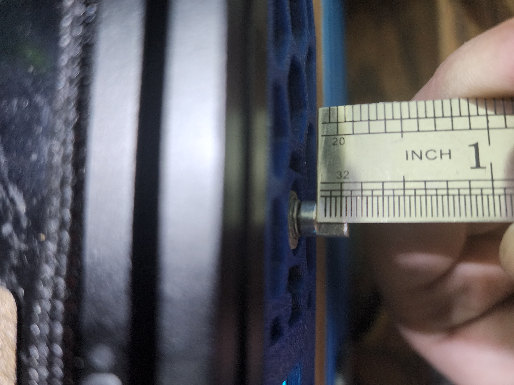

## Purpose

The purpose of this mod is to provide an additional MCU to the V0.1 to drive a small OLED display in the skirt, as well as provide a rotary encoder interface for the menus.  Originally, the reason I started on the design was because I was running into I2C timeout errors on my SSD1306 display when running it directly off of the SKR mainboard in my V0.1, due to the extremely long wire runs which I2C was not designed for.  After all - I2C stands for Inter-Integrated Circuit, and was designed to connect two ICs locally on a single PCB.  As such, it does not do well with long wire runs such as the one I was using to drive the display originally.  

 

It utilizes a Raspberry Pi Pico MCU, which became supported in Klipper not too long ago.  At only $4 a piece, it offers an extremely affordable way to add an MCU to your V0.1.  The display itself is a SSD1306 0.96" I2C-Controlled OLED from UCTRONICS on Amazon, though I'd wager just about any 0.96" I2C OLED panel you buy will work as they all seem to have the same layout and dimensions.  The encoder is a typical KY-040 encoder, available for very cheap all over the place. The Pico then connects to the Raspberry Pi running Klipper over USB, and that's it!

Becuase this is an entirely separate MCU, you can do a lot more with it than just driving a small display and the encoder.  You could easily add some wiring to connect to an ADXL345 to run input shaper (custom wiring harness and connector required), drive some NeoPixels, control an external MOSFET for e.g. fan control, and more.  

## Wiring the display to the Pico MCU

Seeing as the display uses I2C wiring is super simple, using only four wires of which two are used for power.  
** IMPORTANT ** the Pico GPIO is only rated to 3.3V.  I'm not sure if the SSD1306 modules have internal level shifters to ensure the I2C level is kept at 3.3V when powered by 5V, so I'd power the display from 3.3V rather than 5V just to be safe.
Wire them together according to the below list.  I prefer to desolder the pins from the OLED display and solder directly to the pads to keep it as low profile as possible.  

VCC --> 3V3  
GND --> GND  
SCK --> GP1  
SDA --> GP0  

## Wiring the encoder to the Pico MCU

The encoder wiring is also quite simple.  Follow the below list.  You will need to either cut off/desolder the pins or bend them out of the way, because how they come out of the package the pins will hit the skirt piece.

VCC --> 3V3  
GND --> GND  
SW --> GP18  
DT --> GP17  
CLK --> GP16  

## Making the Pico Firmware

To flash the Pico MCU, SSH into your Pi and enter these commands.

1. cd ~/klipper
2. make clean
3. make menuconfig  
    Micro-controller Architecture should be set to "Raspberry Pi RP2040"  
    Communication Interface should be USB  
4. Q (asks you to save, hit Y)

## Flashing your Pico

Once the make commmand is finished, there's a couple ways to flash the firmware to the Pico.  You can either do it on the Pi itself (faster and easier), or use FTP to grab the firmware from the Pi and use a Windows PC to copy it to the Pico (if the first method doesn't work).  These instructions are the easier way:

1. Disconnect the Pico from your Pi if you haven't already.  Then, while holding the BOOTSEL button, plug it into the Pi.  It will go into bootloader mode, where you can flash the firmware.
2. Run this command:
    make flash FLASH_DEVICE=2e8a:0003
    This will automatically copy the file to the onboard flash when the Pico is in bootloader mode.  This feature was not available when I first made this mod, so it's     good to see it here now.
3. To make sure your Pico was flashed correctly, then type the following command:
   ls /dev/serial/by-id/usb-Klipper_rp2040*
   If it was successfully flashed, it will show up as something like:
   /dev/serial/by-id/usb-Klipper_rp2040_E660C06213844C34-if00
   Save this ID for later btw.  You'll need it for the .cfg.
   
   Nothing will happen on the display right now, since there is no configuration done yet.  We'll do that next.

## Setting up .cfg 

Once done with flashing the Pico, all you have to do is upload the pico.cfg I've included to the config folder on your main Pi, then add [include pico.cfg] to your main printer.cfg.  Alternatively, you can just copy the contents of pico.cfg to your main printer.cfg.  I prefer the separate cfg myself, though.

Remember that serial ID you copied earlier when we were checking if the Pico was flashed successfully?  Now you need that.  Replace what's currently in as the ID in pico.cfg with your own serial ID.

Once that's done, you should be able to do a firmware restart and see your new OLED display working just as intended.  You can also test your encoder to ensure it is working.  It should be fast and responsive.

STEP files have also been included in /CAD to allow you to add whatever you want to the skirt.  

## Encoder Knob

Several different versions available here.  First is a through-hole knob that allows you to install it without any cutting on the encosder shaft.  This has the annoying disadvantage that the encoder knob shaft. will sick out past the printed knob handle. The other option is the same knob with no through-hole which means wyou will need to cut your encoder shaft down by about 5mm.  The third option (my personal preference) is the Knob_wide, which is the same deal but requires the encoder shaft to be shortened even more.  You can see approximately how long the shaft should be by looking at this photo.  Not the most elegant soltuion but the end result is quite nice.  

I've also uploaded a wider, shorter knob that will only work if you cut down the encoder shaft by quite a bit.  See below:
 
 

## Notes
1. An 18" micro USB seems to be the perfect length. Obviously longer will work, but you'll need to wrap it around itself a few times to shorten it.  The [MonoPrice 1.5ft Micro USB](https://smile.amazon.com/gp/product/B002HZYBZ6) cable on Amazon is exactly what I am using, and it works great.
2. If you plan to drive NeoPixels with this, beware that it's powered only by the 5V USB line, so you'll be limited in the number of NeoPixels you can drive off the Pico directly.
3. You only need to use the two outermost holes in the skirt to screw the Skirt down.  It has four since it was made using the two separate skirt pieces, but in reality one on each end is fine.  It'd be pretty hard to access the ones towards the middle anyway, what with the Pi and stuff in the way.
4. The hole in the skirt for the encoder is closed off for printability.  It's only one or two layers thick, so that you're not trying to bridge in a circle.  This allows printing without supports.  Once printed, simply use an X-Acto knife or similar to cut out the thin layers.
5. In order to use the Knob_Shortened.stl provided in STLs/CAD, you need to shorten the encoder spline by 5mm.  I found the knob it comes with to be disproportionately long.  Alternatively, I've included the STLs and CAD for the same knob but with a hole in the end (Knob_Through.stl) to allow the spline to extend past.  It looks a bit silly, but it works if you don't have the equipment to shorten the spline on the encoder.
6. You may have to trim a little bit of the PCB on the encoder at the bottom to prevent it from rubbing on/hitting the skirt.  
7. The encoder sticks out quite a bit in the back, inside the skirt.  You may need to move your PSU just slightly inward to avoid the encoder body interfering with the PSU.
8. One weird thing about these SSD1306 OLED displays is that they often have a different color for the top row.  I'm not really sure why this is, but naturally that means the top row of the mdnu will always be that color (in my case, yellow).  I believe there are some of these that are all one color, but that's not what I have.

## USB Cable Routing
This is the best routing I've found for the USB cable. 

 
 

