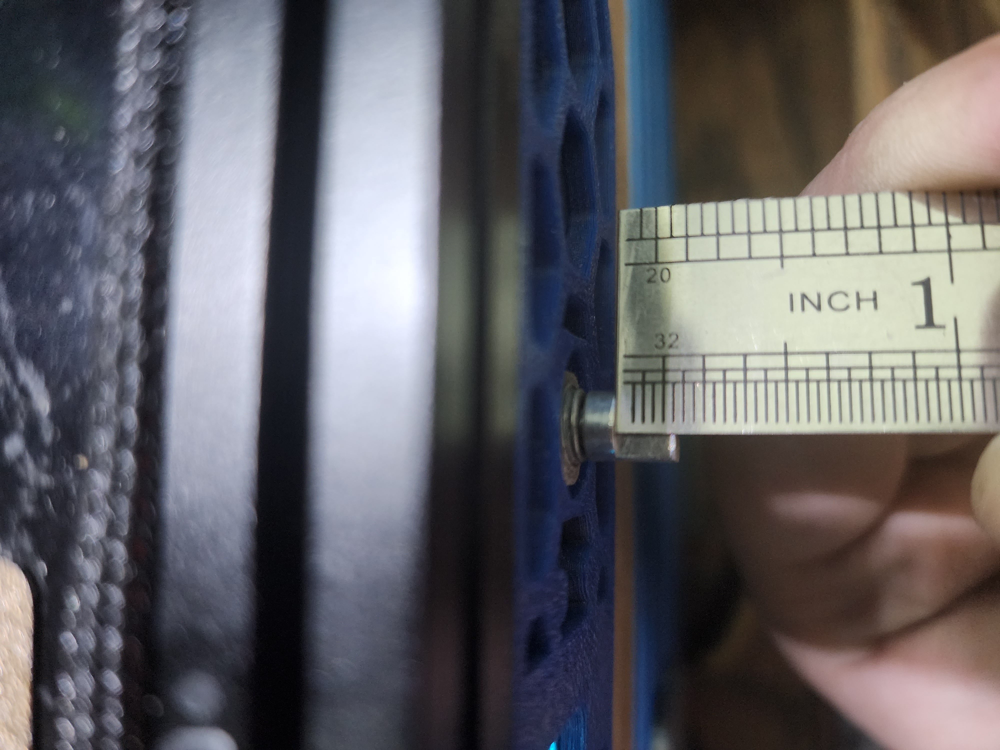

# Purpose

The purpose of this mod is to provide an additional MCU to the V0.1 to add flexibility in accessories and configuration.  
 
Originally, the reason I started on the design was because I was running into I2C timeout errors on my SSD1306 display when running it directly off of the SKR mainboard in my V0.1, due to the extremely long wire runs which I2C was not designed for.  
 
While it may have been solvable,, the addition of a $4 RPi Pico board solves this problem entirely and also provides a bunch of IO for addional features.  This project has evolved over time, starting initially as only a display addon, then an encoder was added, and the latest version also adds a 6pin Micro-Fit 3.0 header to allow connection of an ADXL345 accelerometer for input shaper.  
 
It does all of this within the form factor of the original skirt.

 

## Small Warning:
This mod requires good soldering skills as you will be dealing with small wire, small soldering pads, desoldering, and close quarters work. 

# BOM
### Display-Only Version
- Standard Raspberry Pi Pico
- SSD1306 0.96" OLED I2C Display
- M2x4 SHCS x 8
- Thin Hookup Wire (28-32AWG)
- 1.5ft USB-A to Micro B Cable
- Skirt_OLED.stl

### Display and Encoder Version
- Standard Raspberry Pi Pico
- SSD1306 0.96" OLED I2C Display
- KY-040 Encoder Module
- M2x4 SHCS x 8
- Thin Hookup Wire (28-32AWG)
- 1.5ft USB-A to Micro B Cable
- Skirt_OLED_Encoder.stl
- Knob_Thin.stl

### Display, Encoder, and ADXL Version (WIP)
- Standard Raspberry Pi Pico
- SSD1306 0.96" OLED I2C Display
- KY-040 Encoder Module
- Molex Micro-Fit 3.0 Free-Hanging Version 6-Contacts (PN: 43640-0601)
- M2x4 SHCS x 8
- Thin Hookup Wire (28-32AWG)
- 1.5ft USB-A to Micro B Cable
- Skirt_OLED_Encoder_ADXL.stl
- Knob_Thin.stl
  
# The Display

This mod is designed around the very common generic SSD1306 0.96" OLED display module.  They are sold under a dozen different brands but they all follow the same form factor (more or less).   Attempts have been made to make the skirt as compatible as possible with as many versions of the module as possible, but you should be careful and slow when screwing down the display module the first time to make sure nothing is interfering.  Worst case, the incompatibility is bad enough that the OLED panel cracks, though that has not happened to me yet. 

If you encounter an incompatibility with the particular display module you purchased, reach out via Discord (@BladeScraper) and let me know and I'll see if there's anything I can do to improve the compatibility.

### Wiring the Display
Seeing as the display uses I2C, wiring is super simple using only four wires of which two are used for power.  
 
I'm not sure if the SSD1306 modules have internal level shifters to ensure the I2C level is kept at 3.3V when powered by 5V, so power the display from 3.3V rather than 5V just to be safe.  Every SSD1306 module that I have tested has functioned flawlessly on 3.3V.
 
Wire them together according to the below list.  I highly recommend desoldering the pins from the display module and soldering wires directly which helps to keep it more low profile.  The easiest way to do this is to remove the plastic piece (use a knife to pry it away from the board some, then pull it the rest of the way off) and then desolder the pins one by one.

VCC --> 3V3 OUT (pin36) 
GND --> GND (pin38) 
SCK --> GP1 (pin2) 
SDA --> GP0 (pin1) 

# The Encoder

This mod was designed around the very common generic KY-040 encoder module.  There are a few variations floating around but as far as I can tell, as long as they look like the one pictured above they will be compatible.   

Due to size constraints, you must do a few modifications to the encoder for it to work with this mod.  
- You must de-pin it (similar to the display in the previous section, but this time it's required)
- You must shorten the shaft: 
 

From the face of the encoder's metal body to the end of the shaft must be no more than 15mm.
 

### Wiring the Encoder

The encoder wiring is fairly straight forward.  Officially, the encoder requires 5V, but testing has shown no issues with 3.3V operation, which is a necessity for the Pico. 

For wiring, follow the below list.

VCC --> 3V3 OUT (pin36) 
GND --> GND (pin38) 
SW --> GP18 (pin24) 
DT --> GP17 (pin22) 
CLK --> GP16 (pin21) 

Seemingly randomly, the encoder will scroll the display and adjust selected values in the opposite direction you would expect.  In the case that happens, simply swap the two encoder pins in your config (more on that below).

## Making the Pico Firmware

To flash the Pico MCU, SSH into your Pi and enter these commands.

1. cd ~/klipper
2. make clean
3. make menuconfig  
    Micro-controller Architecture should be set to "Raspberry Pi RP2040"  
    Communication Interface should be USB  
4. Q (asks you to save, hit Y)

## Flashing your Pico

Once the make commmand is finished, there's a couple ways to flash the firmware to the Pico.  You can either do it on the Pi itself (faster and easier), or use FTP to grab the firmware from the Pi and use a Windows PC to copy it to the Pico (if the first method doesn't work).  These instructions are the easier way:

1. Disconnect the Pico from your Pi if you haven't already.  Then, while holding the BOOTSEL button, plug it into the Pi.  It will go into bootloader mode, where you can flash the firmware.
2. Run this command:
    make flash FLASH_DEVICE=2e8a:0003
    This will automatically copy the file to the onboard flash when the Pico is in bootloader mode.  This feature was not available when I first made this mod, so it's     good to see it here now.
3. To make sure your Pico was flashed correctly, then type the following command:
   ls /dev/serial/by-id/usb-Klipper_rp2040*
   If it was successfully flashed, it will show up as something like:
   /dev/serial/by-id/usb-Klipper_rp2040_E660C06213844C34-if00
   Save this ID for later btw.  You'll need it for the .cfg.
   
   Nothing will happen on the display right now, since there is no configuration done yet.  We'll do that next.

## Setting up .cfg 

Once done with flashing the Pico, all you have to do is upload the pico.cfg I've included to the config folder on your main Pi, then add [include pico.cfg] to your main printer.cfg.  Alternatively, you can just copy the contents of pico.cfg to your main printer.cfg.  I prefer the separate cfg myself, though.

Remember that serial ID you copied earlier when we were checking if the Pico was flashed successfully?  Now you need that.  Replace what's currently in as the ID in pico.cfg with your own serial ID.

Once that's done, you should be able to do a firmware restart and see your new OLED display working just as intended.  You can also test your encoder to ensure it is working.  It should be fast and responsive.

STEP files have also been included in /CAD to allow you to add whatever you want to the skirt.  

## Encoder Knob

Several different versions available here.  First is a through-hole knob that allows you to install it without any cutting on the encosder shaft.  This has the annoying disadvantage that the encoder knob shaft. will sick out past the printed knob handle. The other option is the same knob with no through-hole which means wyou will need to cut your encoder shaft down by about 5mm.  The third option (my personal preference) is the Knob_wide, which is the same deal but requires the encoder shaft to be shortened even more.  You can see approximately how long the shaft should be by looking at this photo.  Not the most elegant soltuion but the end result is quite nice.  

I've also uploaded a wider, shorter knob that will only work if you cut down the encoder shaft by quite a bit.  See below:

## Notes
1. An 18" micro USB seems to be the perfect length. Obviously longer will work, but you'll need to wrap it around itself a few times to shorten it.  The [MonoPrice 1.5ft Micro USB](https://smile.amazon.com/gp/product/B002HZYBZ6) cable on Amazon is exactly what I am using, and it works great.
2. If you plan to drive NeoPixels with this, beware that it's powered only by the 5V USB line, so you'll be limited in the number of NeoPixels you can drive off the Pico directly.
3. You only need to use the two outermost holes in the skirt to screw the Skirt down.  It has four since it was made using the two separate skirt pieces, but in reality one on each end is fine.  It'd be pretty hard to access the ones towards the middle anyway, what with the Pi and stuff in the way.
4. The hole in the skirt for the encoder is closed off for printability.  It's only one or two layers thick, so that you're not trying to bridge in a circle.  This allows printing without supports.  Once printed, simply use an X-Acto knife or similar to cut out the thin layers.
5. In order to use the Knob_Shortened.stl provided in STLs/CAD, you need to shorten the encoder spline by 5mm.  I found the knob it comes with to be disproportionately long.  Alternatively, I've included the STLs and CAD for the same knob but with a hole in the end (Knob_Through.stl) to allow the spline to extend past.  It looks a bit silly, but it works if you don't have the equipment to shorten the spline on the encoder.
6. You may have to trim a little bit of the PCB on the encoder at the bottom to prevent it from rubbing on/hitting the skirt.  
7. The encoder sticks out quite a bit in the back, inside the skirt.  You may need to move your PSU just slightly inward to avoid the encoder body interfering with the PSU.
8. One weird thing about these SSD1306 OLED displays is that they often have a different color for the top row.  I'm not really sure why this is, but naturally that means the top row of the mdnu will always be that color (in my case, yellow).  I believe there are some of these that are all one color, but that's not what I have.

## USB Cable Routing
This is the best routing I've found for the USB cable. 

 
 

