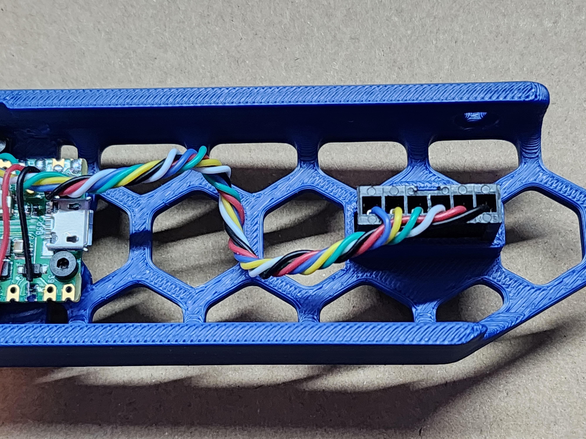
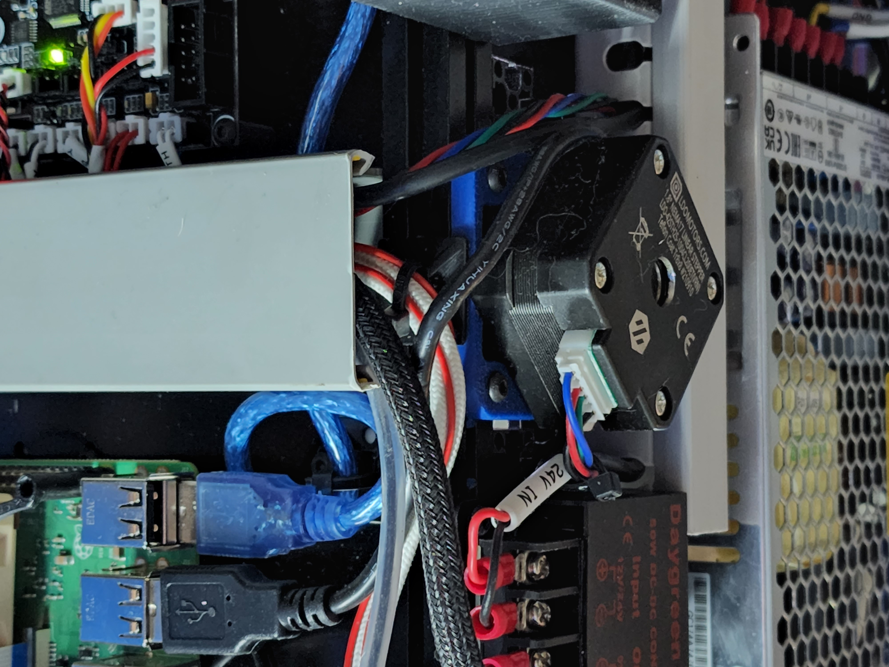

# Purpose

The purpose of this mod is to provide an additional MCU to the V0.1 to add flexibility in accessories and configuration.  
<br>
Originally, the reason I started on the design was because I was running into I2C timeout errors on my SSD1306 display when running it directly off of the SKR mainboard in my V0.1, due to the extremely long wire runs which I2C was not designed for.  
<br>
While it may have been solvable,, the addition of a $4 RPi Pico board solves this problem entirely and also provides a bunch of IO for addional features.  This project has evolved over time, starting initially as only a display addon, then an encoder was added, and the latest version also adds a 6pin Micro-Fit 3.0 header to allow connection of an ADXL345 accelerometer for input shaper.  
<br>
It does all of this within the form factor of the original skirt.

<br>

## Small Warning:
This mod requires good soldering skills as you will be dealing with small wire, small soldering pads, desoldering, and close quarters work. 

# BOM
### Display-Only Version
- Standard Raspberry Pi Pico
- SSD1306 0.96" OLED I2C Display
- M2x4 SHCS x 8
- Thin Hookup Wire (28-32AWG)
- 1.5ft USB-A to Micro B Cable
- Skirt_OLED.stl

### Display and Encoder Version
- Standard Raspberry Pi Pico
- SSD1306 0.96" OLED I2C Display
- KY-040 Encoder Module
- M2x4 SHCS x 8
- Thin Hookup Wire (28-32AWG)
- 1.5ft USB-A to Micro B Cable
- Skirt_OLED_Encoder.stl
- Knob_Thin.stl

### Display, Encoder, and ADXL Version (WIP)
- Standard Raspberry Pi Pico
- SSD1306 0.96" OLED I2C Display
- KY-040 Encoder Module
- Molex Micro-Fit 3.0 Free-Hanging Version 6-Contacts (PN: 43640-0601)
- M2x4 SHCS x 8
- Thin Hookup Wire (28-32AWG)
- 1.5ft USB-A to Micro B Cable
- Skirt_OLED_Encoder_ADXL.stl
- Knob_Thin.stl
  
# The Display


This mod is designed around the very common generic SSD1306 0.96" OLED display module.  They are sold under a dozen different brands but they all follow the same form factor (more or less).   Attempts have been made to make the skirt as compatible as possible with as many versions of the module as possible, but you should be careful and slow when screwing down the display module the first time to make sure nothing is interfering.  Worst case, the incompatibility is bad enough that the OLED panel cracks, though that has not happened to me yet.<br>

If you encounter an incompatibility with the particular display module you purchased, reach out via Discord (@BladeScraper) and let me know and I'll see if there's anything I can do to improve the compatibility.

### Wiring the Display
Seeing as the display uses I2C, wiring is super simple using only four wires of which two are used for power. <br>
<br>
I'm not sure if the SSD1306 modules have internal level shifters to ensure the I2C level is kept at 3.3V when powered by 5V, so power the display from 3.3V rather than 5V just to be safe.  Every SSD1306 module that I have tested has functioned flawlessly on 3.3V.
<br>
Wire them together according to the below list.  I highly recommend desoldering the pins from the display module and soldering wires directly which helps to keep it more low profile.  The easiest way to do this is to remove the plastic piece (use a knife to pry it away from the board some, then pull it the rest of the way off) and then desolder the pins one by one.

GND --> GND (pin38)<br>
VCC --> 3V3 OUT (pin36)<br>
SCK --> GP1 (pin2)<br>
SDA --> GP0 (pin1)<br>

# The Encoder


This mod was designed around the very common generic KY-040 encoder module.  There are a few variations floating around but as far as I can tell, as long as they look like the one pictured above they will be compatible.<br>  

Due to size constraints, you must do a few modifications to the encoder for it to work with this mod.  
- You must de-pin it (similar to the display in the previous section, but this time it's required)
- You must shorten the shaft:<br>
    From the face of the encoder's metal body to the end of the shaft must be no more than 15mm.  Use a dremel cutoff wheel or hacksaw to shorten it.  Slightly shorter is fine, but longer means the D-key will not fully engage.
    <br>

### Wiring the Encoder

The encoder wiring is fairly straight forward.  Officially, the encoder requires 5V, but testing has shown no issues with 3.3V operation, which is a necessity for the Pico. 

For wiring, follow the below list.

GND --> GND (pin38)<br>
VCC --> 3V3 OUT (pin36)<br>
SW --> GP18 (pin24)<br>
DT --> GP17 (pin22)<br>
CLK --> GP16 (pin21)<br>

Seemingly randomly, the encoder will scroll the display and adjust selected values in the opposite direction you would expect.  In the case that happens, simply swap the two encoder pins in your config (more on that below).

# The ADXL Connector

<br>

This mod was designed around the Molex Micro-Fit 3.0 connector 1x6 for connection to an ADXL345 accelerometer via SPI.  See BOM for the exact connector required.  It is a nice snug fit in the opening in the Skirt as designed.  In  most cases, it will be snug enough that it won't move at all as you're removing/inserting the other side of the connector. If it's too loose, you can use a dab of hot glue to secure it in place.  You could use super glue, but you probably shouldn't if you ever want the connector to come back out. 

### Wiring the ADXL Connector

As far as the pinout of this connector, it really doesn't matter.  You can wire it however you want, as long as the pins match up on both ends.  I chose to wire it as follows, from left to right (when looking at the skirt from the front).  This matches 1:1 the connector on the ADXL module itself, minus the INT1 and INT2 pins:<br>

GND, VCC, CS, SDO, SDA, SCL

<br>

As far as soldering goes, you need to use the spi0b connections on the GPIO pins.  This is because the connections for the display takes up some of the spi0a connections.  The spi0b connections are as follows:

GND --> GND (pin38)<br>
VCC --> 3V3 OUT (pin36)<br>
CS --> GP5 (pin7)<br>
SDO --> GP4 (pin6)<br>
SDA --> GP7 (pin10)<br>
SCL --> GP6 (pin9)<br>

# Flashing the Pico

### Making the Firmware
Before flashing, we first need to configure Klipper for the Pico microcontroller.  Once that's done, we tell Klipper to "make" (compile) the firmware.
To create the firmware for the Pico, SSH into your Pi and enter these commands:

```
cd ~/klipper
make clean
make menuconfig <br>
```

Micro-controller Architecture should be set to "Raspberry Pi RP2040" <br>
Communication Interface should be USB <br>
Then run:
```
make
```

### Flashing the Pico

Once the make commmand is finished, there's a couple ways to flash the firmware to the Pico.  You can either do it on the Pi itself (faster and easier), or use FTP to grab the firmware from the Pi and use a Windows PC to copy it to the Pico (if the first method doesn't work).  These instructions are the easier way:

Disconnect the Pico from your Pi if you haven't already.  Then, while holding the BOOTSEL button, plug it into the Pi.  It will go into bootloader mode and mount a small removable drive to your Pi.

1. Run this command:
```
make flash FLASH_DEVICE=2e8a:0003
```
This will automatically copy the file to the onboard flash when the Pico is in bootloader mode.  This feature was not available when I first made this mod, so it's good to see it here now.<br>
<br>

2. To make sure your Pico was flashed correctly, then type the following command:
```
ls /dev/serial/by-id/usb-Klipper_rp2040*
```
If the Pico was successfully flashed, it will show up as something like:
```
usb-Klipper_rp2040_BunchOfRandomNumbersAndLetters
```
Save this ID for later btw.  You'll need it for the .cfg.<br>
   
Nothing will happen on the display right now, since there is no configuration done yet.  We'll do that next.


# Configuring Klipper

Once done with flashing the Pico, all you have to do is upload the picoled.cfg I've included to your main Pi, then add [include picoled.cfg] to your main printer.cfg.  Alternatively, you can just copy the contents of picoled.cfg to your main printer.cfg.  I prefer the separate cfg myself, though.

Remember that serial ID you copied earlier when we were checking if the Pico was flashed successfully?  Now you need that.  Replace what's currently in as the ID in picoled.cfg with your own serial ID.

Once that's done, you should be able to do a firmware restart and see your new OLED display working just as intended.  You can also test your encoder to ensure it is working.

STEP files have also been included in /CAD to allow you to add whatever you want to the skirt.  

# Notes
1. If you plan to drive NeoPixels with this, beware that it's powered only by the 5V USB line, so you'll be limited in the number of NeoPixels you can drive off the Pico directly.
2. The hole in the skirt for the encoder is closed off for printability.  It's only one or two layers thick, so that you're not trying to bridge in a circle.  This allows printing without supports.  Once printed, simply use an X-Acto knife or similar to cut out the thin layers.
3. The encoder sticks out quite a bit in the back, inside the skirt.  You may need to move your PSU just slightly inward to avoid the encoder body interfering with the PSU.
4. Variations of the SSD1306 module sometimes have two colors, e.g. blue and yellow, others have all white, others different still.  Pay attention to product photos and descriptions if you want a specific color when buying your display module.
5. If you go to test the ADXL for the first time and you get an error like this, don't panic.  For some reason, the first time you try to use the ADXL after a firmware (re)start, it errors like this.  The second try it then begins working normally.  I have observed this multiple times with multiple ADXL chips and multiple Picos, so I'm beginning to think it's a bug in Klipper.  If, however, you try a second time and it still doesn't work, that probably means your wiring is wrong.<br>
  <br>

## USB Cable Routing
This is the best routing I've found for the USB cable. 

<br>
<br>

