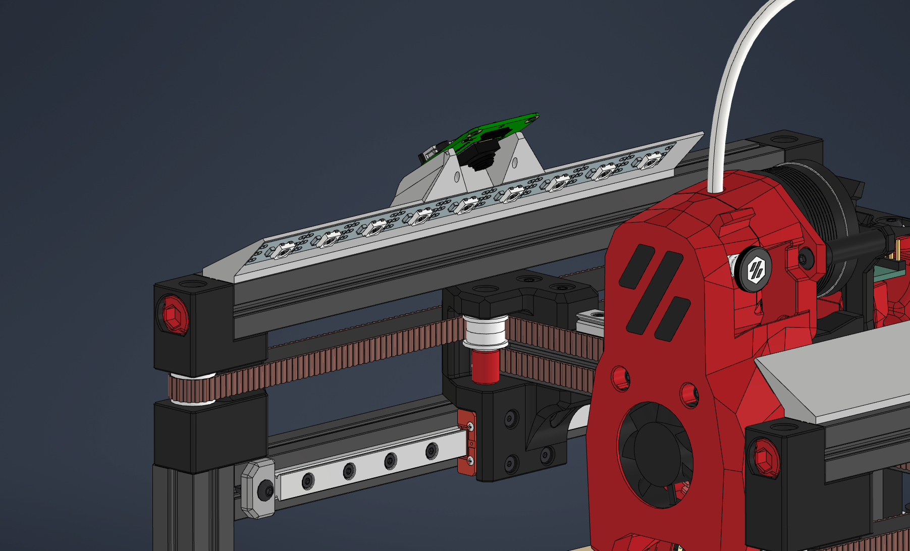
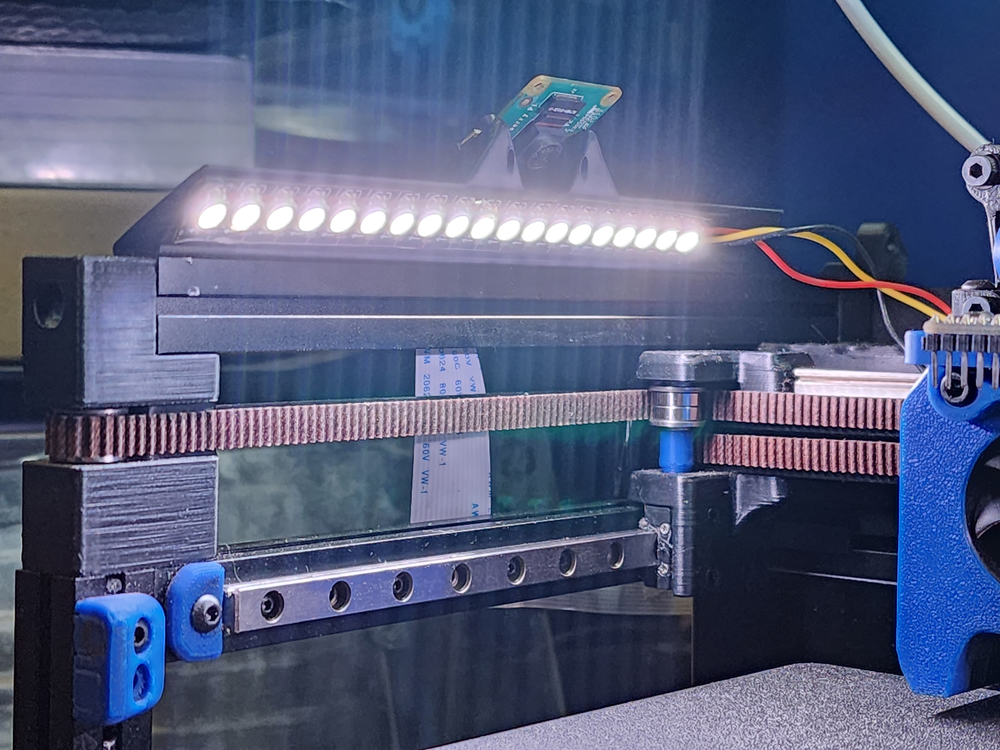
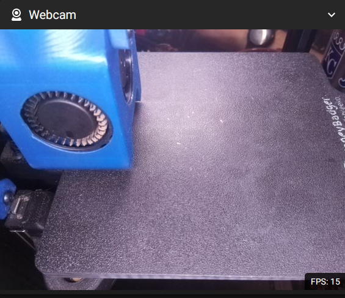

## Purpose

The purpose of this mod is to provide a simple to print and install, all-in-one LED and PiCam solution for the V0 series printers.  There are a number of LED and camera mounts available for the V0 but none of them quite hit all the right marks for me, so I made my own.

-No hardware to attach to the frame, minimal hardware in general 
-Snug clip-in fit with LDO 1515 rails (there are a couple clip-in solutions, but none were as snug in the rail as I wanted) 
-Fit extra wide LED strips 
-Hold Raspberry Pi Camera V2 
-Symmetrical Design (can easily put the camera on either side without different STLs) 
-Camera on side extrusion (as opposed to in the tophat like some camera solutions do)

I believe these goals were satisfied well enough.  

### BOM:  
2 x M2x8 SHCS  

### Print Instructions: 
-Print vertically as the STLs come oriented. 
-Suggested 2 walls, 0 top layers, 0 bottom layers, and a nice wide brim (I used 8mm). 
-Use plenty of cooling as the overhang angles get pretty steep in places.  100% on Stealthburner PCF proved sufficient for me. 

As they are designed to be a very snug snap-in, you may need to tweak your extrusion multiplier to get it just right.  If it's impossible to put into the rail, try lowering your EM just a tad and try again.  

Note that these are designed for LDO 1515 extrusions.  I have not tested with Makerbeam.  It may fit or it may not.  Give it a shot and let me know one way or the other and I'll add a note to this readme. 

As far as I can tell, it should work with all V0 versions (0.0, 0.1, 0.2).  I tested it on my V0.1 and also put it in CAD on the V0.2.  

